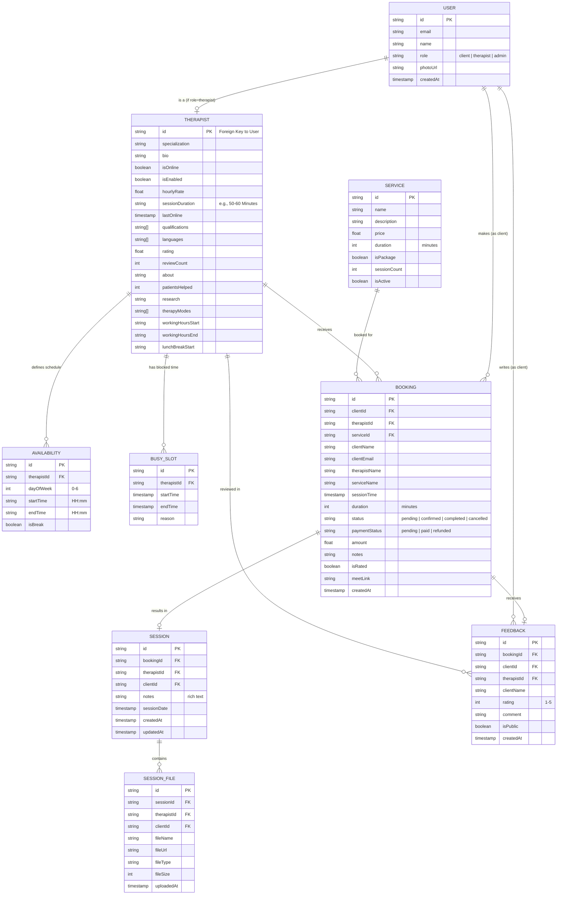

# Clinic Application Entity-Relationship (ER) Diagram

Below is the comprehensive Entity-Relationship Diagram for your clinic application, based on the application's TypeScript definitions and Firestore NoSQL structure. You can use this for your project documentation.

## Relational Tabular Representation (Firestore Collections)

Since this project uses Firebase Firestore (NoSQL), below is the tabular/relational representation of the Documents contained in each Collection, mapping out their specific data types and references.

### 1. `users` Collection
Stores authentication-level users. This contains both Clients and Therapists.

| Field | Type | Description |
| :--- | :--- | :--- |
| **id** | `string` | Primary Key (Firebase Auth UID) |
| email | `string` | User's email address |
| name | `string` | Full name |
| role | `enum` | `'client'`, `'therapist'`, or `'admin'` |
| photoUrl | `string` | URL to profile picture (optional) |
| createdAt | `timestamp` | Account creation timestamp |

### 2. `therapists` Collection
Stores public profiles and clinical data for users with the `therapist` role. The document ID directly matches the `users` ID.

| Field | Type | Description |
| :--- | :--- | :--- |
| **id** | `string` | Primary/Foreign Key (Matches `users.id`) |
| specialization | `string` | Primary field of work |
| bio | `string` | Short description |
| isOnline | `boolean` | Live presence indicator |
| isEnabled | `boolean` | Account active status |
| hourlyRate | `number` | Cost per session |
| sessionDuration | `string` | "30 Minutes", "50-60 Minutes", etc. |
| lastOnline | `timestamp` | Last seen activity |
| qualifications | `array<string>` | Degrees and certifications |
| languages | `array<string>` | Spoken languages |
| rating | `number` | Aggregate review score (1-5) |
| reviewCount | `number` | Total number of reviews |
| about / research | `string` | Extended text descriptions |
| therapyModes | `array<string>` | E.g., "Video", "In-Person" |
| workingHoursStart | `string` | E.g., "10:00" |
| workingHoursEnd | `string` | E.g., "19:00" |
| lunchBreakStart | `string` | E.g., "13:00" |

### 3. `availabilities` Collection
Defines weekly repeating schedules for therapists.

| Field | Type | Description |
| :--- | :--- | :--- |
| **id** | `string` | Primary Key |
| **therapistId** | `string` | Foreign Key → `therapists.id` |
| dayOfWeek | `number` | 0 (Sun) to 6 (Sat) |
| startTime | `string` | HH:mm (24-hour) |
| endTime | `string` | HH:mm (24-hour) |
| isBreak | `boolean` | If true, slot is a blocked recurring break |

### 4. `busySlots` Collection
One-off specific blocked times (e.g., vacations, sick days, existing appointments outside the system).

| Field | Type | Description |
| :--- | :--- | :--- |
| **id** | `string` | Primary Key |
| **therapistId** | `string` | Foreign Key → `therapists.id` |
| startTime | `timestamp` | Exact start date/time |
| endTime | `timestamp` | Exact end date/time |
| reason | `string` | Optional text note |

### 5. `services` Collection
Specific service packages that can be offered/booked.

| Field | Type | Description |
| :--- | :--- | :--- |
| **id** | `string` | Primary Key |
| name | `string` | Service name |
| description | `string` | Service details |
| price | `number` | Service cost |
| duration | `number` | Session length in minutes |
| isPackage | `boolean` | Whether it contains multiple sessions |
| sessionCount | `number` | E.g., 1 for single session |
| isActive | `boolean` | Toggle availability |

### 6. `bookings` Collection
The core transactional document connecting clients, therapists, and payments.

| Field | Type | Description |
| :--- | :--- | :--- |
| **id** | `string` | Primary Key |
| **clientId** | `string` | Foreign Key → `users.id` |
| **therapistId** | `string` | Foreign Key → `therapists.id` |
| **serviceId** | `string` | Foreign Key → `services.id` (optional) |
| clientName / Email | `string` | Denormalized reference data |
| therapistName | `string` | Denormalized reference data |
| sessionTime | `timestamp` | Scheduled date/time |
| duration | `number` | Specific booked duration |
| status | `enum` | `'pending'`, `'confirmed'`, `'completed'`, `'cancelled'` |
| paymentStatus | `enum` | `'pending'`, `'paid'`, `'refunded'` |
| amount | `number` | Total cost |
| notes | `string` | Optional client notes at booking |
| isRated | `boolean` | True if feedback exists |
| meetLink | `string` | Video call URL |

### 7. `sessions` & `session_files` Collections
Clinical notes and attachments created by the therapist after a booking.

| Field | Type | Description |
| :--- | :--- | :--- |
| **id** | `string` | Primary Key |
| **bookingId** | `string` | Foreign Key → `bookings.id` |
| **therapistId / clientId**| `string` | Foreign Keys |
| notes | `string` | Rich text clinical logs |
| sessionDate | `timestamp` | Date of occurrence |

| Field (File) | Type | Description |
| :--- | :--- | :--- |
| **id** | `string` | Primary Key |
| **sessionId** | `string` | Foreign Key → `sessions.id` |
| fileUrl | `string` | Cloud Storage URL |
| fileName / fileType | `string` | Metadata |

### 8. `feedback` Collection
Client reviews generated after a completed booking.

| Field | Type | Description |
| :--- | :--- | :--- |
| **id** | `string` | Primary Key |
| **bookingId** | `string` | Foreign Key → `bookings.id` |
| **clientId** | `string` | Foreign Key → `users.id` |
| **therapistId** | `string` | Foreign Key → `therapists.id` |
| rating | `number` | Integer 1-5 |
| comment | `string` | Optional review text |
| isPublic | `boolean` | Whether it displays on the public profile |
| createdAt | `timestamp` | Review submission time |

## Explanation of Key Entities & Relationships

1. **Users & Therapists**: The database uses a single `Users` collection for authentication basics. Therapists have extended profiles stored in the `Therapists` collection using the exact same `id` (One-to-One relationship).
2. **Scheduling**: Therapists define weekly `Availability` alongside specific one-off `Busy_Slots` for leaves or breaks.
3. **Bookings**: The central transactional node. A `Booking` connects a Client (`User`), a `Therapist`, and optionally a `Service`. It holds both status (`pending`, `confirmed`) and payment information.
4. **Sessions**: Once a booking happens, it can have an associated `Session` object where the therapist keeps private clinical notes. Sessions can also have multiple `Session_Files` (documents, worksheets) attached.
5. **Feedback**: After a booking is completed, a client can leave `Feedback`, connecting directly back to the Therapist and the original Booking.
